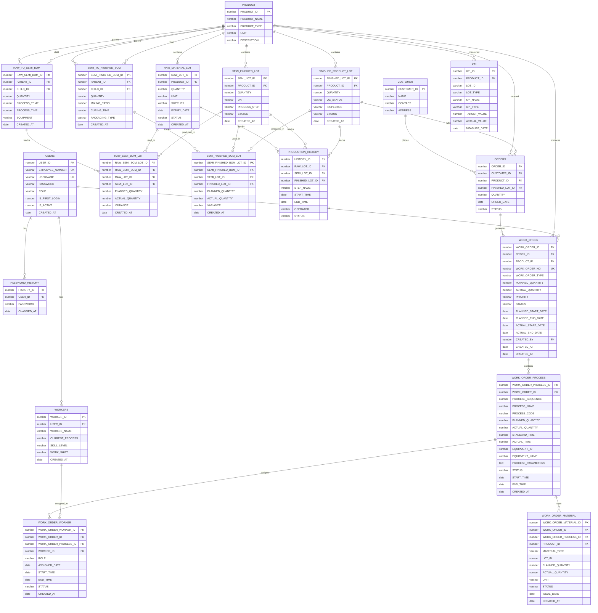
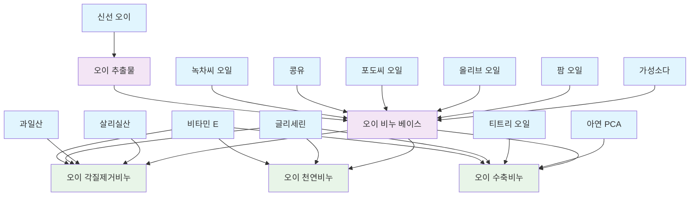
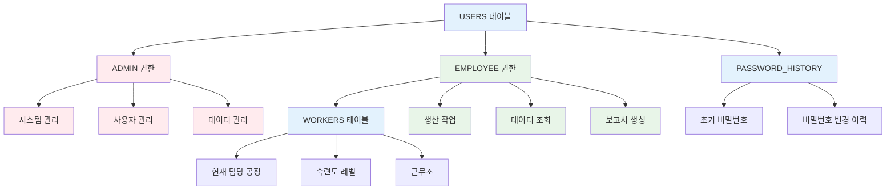

# 🗄️ MES 시스템 데이터베이스 설계서
## 오이비누 제조업 생산관리시스템

---

## 1. 데이터베이스 개요

### 1.1 설계 목적
- 오이비누 제조업의 생산 과정을 체계적으로 관리하기 위한 데이터베이스 설계
- 제품별, 단계별 생산 이력 추적 및 품질 관리
- 실시간 생산 현황 모니터링 및 KPI 분석

### 1.2 데이터베이스 정보
- **DBMS**: Oracle 19c
- **총 테이블 수**: 19개
- **주요 엔티티**: 사용자, 작업자, 제품, LOT, 고객, BOM, 생산이력, 주문, KPI, 작업지시
- **설계 패턴**: 정규화된 관계형 데이터베이스

---

## 2. ERD (Entity Relationship Diagram)

### 2.1 전체 시스템 ERD


### 2.2 제품별 BOM 관계도


### 2.3 공정별 LOT 관리 흐름도

```mermaid
flowchart LR
    %% 원자재 단계
    A[원자재 입고] --> B[RAW_MATERIAL_LOT]
    B --> C[원자재 검사]
    C --> D[원자재 보관]
    
    %% 반제품 단계
    D --> E[원자재→반제품 공정]
    E --> F[RAW_TO_SEMI_BOM]
    F --> G[SEMI_FINISHED_LOT]
    G --> H[반제품 검사]
    H --> I[반제품 보관]
    
    %% 완제품 단계
    I --> J[반제품→완제품 공정]
    J --> K[SEMI_TO_FINISHED_BOM]
    K --> L[FINISHED_PRODUCT_LOT]
    L --> M[완제품 검사]
    M --> N[완제품 보관]
    N --> O[출하]
    
    %% BOM_LOT 추적
    F --> P[RAW_SEMI_BOM_LOT]
    K --> Q[SEMI_FINISHED_BOM_LOT]
    
    %% 스타일링
    classDef process fill:#fff3e0
    classDef lot fill:#e3f2fd
    classDef bom fill:#f1f8e9
    classDef inspection fill:#fce4ec
    
    class A,E,J process
    class B,G,L lot
    class F,K,P,Q bom
    class C,H,M inspection
```


### 2.4 사용자 권한 및 작업자 관리 구조


---

## 3. 테이블 상세 설계

### 3.1 사용자 관리 테이블

#### 3.1.1 USERS (사용자 계정 관리)
```sql
CREATE TABLE USERS (
    USER_ID NUMBER PRIMARY KEY,                       -- 사용자 고유 식별번호
    EMPLOYEE_NUMBER VARCHAR2(20) UNIQUE NOT NULL,     -- 사원번호
    USERNAME VARCHAR2(50) UNIQUE NOT NULL,            -- 사용자명
    PASSWORD VARCHAR2(100) NOT NULL,                  -- 비밀번호
    ROLE VARCHAR2(20) DEFAULT 'EMPLOYEE',             -- 역할 (ADMIN/EMPLOYEE)
    IS_FIRST_LOGIN NUMBER(1) DEFAULT 1,               -- 최초 로그인 여부
    IS_ACTIVE NUMBER(1) DEFAULT 1,                    -- 계정 활성화 여부
    CREATED_AT DATE DEFAULT SYSDATE                   -- 생성일
);
```

#### 3.1.2 PASSWORD_HISTORY (비밀번호 변경 이력)
```sql
CREATE TABLE PASSWORD_HISTORY (
    HISTORY_ID NUMBER PRIMARY KEY,                    -- 이력 고유 식별번호
    USER_ID NUMBER REFERENCES USERS(USER_ID),         -- 사용자 참조 번호
    PASSWORD VARCHAR2(100) NOT NULL,                  -- 이전 비밀번호
    CHANGED_AT DATE DEFAULT SYSDATE                   -- 변경일
);
```

#### 3.1.3 WORKERS (작업자 관리)
```sql
CREATE TABLE WORKERS (
    WORKER_ID NUMBER PRIMARY KEY,                     -- 작업자 고유 식별번호
    USER_ID NUMBER REFERENCES USERS(USER_ID),         -- 사용자 계정 참조 번호
    WORKER_NAME VARCHAR2(100) NOT NULL,               -- 작업자명
    CURRENT_PROCESS VARCHAR2(100),                    -- 현재 담당 공정
    SKILL_LEVEL VARCHAR2(20),                         -- 숙련도 (BEGINNER/INTERMEDIATE/EXPERT)
    WORK_SHIFT VARCHAR2(20),                          -- 근무조 (DAY/NIGHT)
    CREATED_AT DATE DEFAULT SYSDATE                   -- 생성일
);
```

### 3.2 제품 관리 테이블

#### 3.2.1 PRODUCT (제품 정보)
```sql
CREATE TABLE PRODUCT (
    PRODUCT_ID NUMBER PRIMARY KEY,                    -- 제품 고유 식별번호
    PRODUCT_NAME VARCHAR2(100) NOT NULL,              -- 제품명
    PRODUCT_TYPE VARCHAR2(20) NOT NULL,               -- 제품 유형 (RAW/SEMI_FINISHED/FINISHED)
    UNIT VARCHAR2(20),                                -- 단위 (kg, L, 개, g)
    DESCRIPTION VARCHAR2(500)                         -- 제품 설명
);
```

### 3.3 LOT 관리 테이블 (제품 유형별 분리)

#### 3.3.1 RAW_MATERIAL_LOT (원자재 LOT)
```sql
CREATE TABLE RAW_MATERIAL_LOT (
    RAW_LOT_ID NUMBER PRIMARY KEY,                    -- 원자재 LOT 고유 식별번호
    PRODUCT_ID NUMBER REFERENCES PRODUCT(PRODUCT_ID), -- 원자재 제품 참조
    QUANTITY NUMBER(10,2),                            -- 수량
    UNIT VARCHAR2(10),                                -- 단위 (kg, L, g)
    SUPPLIER VARCHAR2(100),                           -- 공급업체
    EXPIRY_DATE DATE,                                 -- 유통기한
    STATUS VARCHAR2(20) DEFAULT 'IVB',                -- 상태
    CREATED_AT DATE DEFAULT SYSDATE                   -- 생성일
);
```

#### 3.3.2 SEMI_FINISHED_LOT (반제품 LOT)
```sql
CREATE TABLE SEMI_FINISHED_LOT (
    SEMI_LOT_ID NUMBER PRIMARY KEY,                   -- 반제품 LOT 고유 식별번호
    PRODUCT_ID NUMBER REFERENCES PRODUCT(PRODUCT_ID), -- 반제품 제품 참조
    QUANTITY NUMBER(10,2),                            -- 수량
    UNIT VARCHAR2(10),                                -- 단위 (kg, L)
    PROCESS_STEP VARCHAR2(50),                        -- 공정 단계
    STATUS VARCHAR2(20) DEFAULT 'IVB',                -- 상태
    CREATED_AT DATE DEFAULT SYSDATE                   -- 생성일
);
```

#### 3.3.3 FINISHED_PRODUCT_LOT (완제품 LOT)
```sql
CREATE TABLE FINISHED_PRODUCT_LOT (
    FINISHED_LOT_ID NUMBER PRIMARY KEY,               -- 완제품 LOT 고유 식별번호
    PRODUCT_ID NUMBER REFERENCES PRODUCT(PRODUCT_ID), -- 완제품 제품 참조
    QUANTITY NUMBER(10),                              -- 수량 (개수)
    QC_STATUS VARCHAR2(20) DEFAULT 'PENDING',         -- 품질검사 상태
    INSPECTOR VARCHAR2(100),                          -- 검사자
    STATUS VARCHAR2(20) DEFAULT 'IVB',                -- 상태
    CREATED_AT DATE DEFAULT SYSDATE                   -- 생성일
);
```

### 3.4 BOM 관리 테이블 (공정 단계별 분리)

#### 3.4.1 RAW_TO_SEMI_BOM (원자재→반제품 BOM)
```sql
CREATE TABLE RAW_TO_SEMI_BOM (
    RAW_SEMI_BOM_ID NUMBER PRIMARY KEY,               -- 원자재→반제품 BOM 고유 식별번호
    PARENT_ID NUMBER REFERENCES PRODUCT(PRODUCT_ID),  -- 반제품 (목표)
    CHILD_ID NUMBER REFERENCES PRODUCT(PRODUCT_ID),   -- 원자재 (소재)
    QUANTITY NUMBER(10,2) NOT NULL,                   -- 필요 수량
    PROCESS_TEMP NUMBER(5,2),                         -- 공정 온도
    PROCESS_TIME NUMBER(5,2),                         -- 공정 시간
    EQUIPMENT VARCHAR2(50),                           -- 사용 설비
    CREATED_AT DATE DEFAULT SYSDATE                   -- 생성일
);
```

#### 3.4.2 SEMI_TO_FINISHED_BOM (반제품→완제품 BOM)
```sql
CREATE TABLE SEMI_TO_FINISHED_BOM (
    SEMI_FINISHED_BOM_ID NUMBER PRIMARY KEY,          -- 반제품→완제품 BOM 고유 식별번호
    PARENT_ID NUMBER REFERENCES PRODUCT(PRODUCT_ID),  -- 완제품 (목표)
    CHILD_ID NUMBER REFERENCES PRODUCT(PRODUCT_ID),   -- 반제품 (소재)
    QUANTITY NUMBER(10,2) NOT NULL,                   -- 필요 수량
    MIXING_RATIO NUMBER(5,2),                         -- 배합 비율
    CURING_TIME NUMBER(5,2),                          -- 숙성 시간
    PACKAGING_TYPE VARCHAR2(50),                      -- 포장 타입
    CREATED_AT DATE DEFAULT SYSDATE                   -- 생성일
);
```

### 3.5 BOM_LOT 관리 테이블 (공정 단계별 분리)

#### 3.5.1 RAW_SEMI_BOM_LOT (원자재→반제품 BOM_LOT)
```sql
CREATE TABLE RAW_SEMI_BOM_LOT (
    RAW_SEMI_BOM_LOT_ID NUMBER PRIMARY KEY,           -- 원자재→반제품 BOM_LOT 고유 식별번호
    RAW_SEMI_BOM_ID NUMBER REFERENCES RAW_TO_SEMI_BOM(RAW_SEMI_BOM_ID), -- BOM 참조
    RAW_LOT_ID NUMBER REFERENCES RAW_MATERIAL_LOT(RAW_LOT_ID),          -- 원자재 LOT 참조
    SEMI_LOT_ID NUMBER REFERENCES SEMI_FINISHED_LOT(SEMI_LOT_ID),       -- 반제품 LOT 참조
    PLANNED_QUANTITY NUMBER(10,2),                    -- 계획 수량
    ACTUAL_QUANTITY NUMBER(10,2),                     -- 실제 사용 수량
    VARIANCE NUMBER(10,2),                            -- 차이 (실제-계획)
    CREATED_AT DATE DEFAULT SYSDATE                   -- 생성일
);
```

#### 3.5.2 SEMI_FINISHED_BOM_LOT (반제품→완제품 BOM_LOT)
```sql
CREATE TABLE SEMI_FINISHED_BOM_LOT (
    SEMI_FINISHED_BOM_LOT_ID NUMBER PRIMARY KEY,      -- 반제품→완제품 BOM_LOT 고유 식별번호
    SEMI_FINISHED_BOM_ID NUMBER REFERENCES SEMI_TO_FINISHED_BOM(SEMI_FINISHED_BOM_ID), -- BOM 참조
    SEMI_LOT_ID NUMBER REFERENCES SEMI_FINISHED_LOT(SEMI_LOT_ID),       -- 반제품 LOT 참조
    FINISHED_LOT_ID NUMBER REFERENCES FINISHED_PRODUCT_LOT(FINISHED_LOT_ID),           -- 완제품 LOT 참조
    PLANNED_QUANTITY NUMBER(10,2),                    -- 계획 수량
    ACTUAL_QUANTITY NUMBER(10,2),                     -- 실제 사용 수량
    VARIANCE NUMBER(10,2),                            -- 차이 (실제-계획)
    CREATED_AT DATE DEFAULT SYSDATE                   -- 생성일
);
```

### 3.6 생산 이력 관리 테이블

#### 3.6.1 PRODUCTION_HISTORY (생산 이력)
```sql
CREATE TABLE PRODUCTION_HISTORY (
    HISTORY_ID NUMBER(20) PRIMARY KEY,                -- 이력 고유 식별번호
    RAW_LOT_ID NUMBER REFERENCES RAW_MATERIAL_LOT(RAW_LOT_ID),      -- 원자재 LOT 참조
    SEMI_LOT_ID NUMBER REFERENCES SEMI_FINISHED_LOT(SEMI_LOT_ID),   -- 반제품 LOT 참조
    FINISHED_LOT_ID NUMBER REFERENCES FINISHED_PRODUCT_LOT(FINISHED_LOT_ID), -- 완제품 LOT 참조
    STEP_NAME VARCHAR2(100),                          -- 공정 단계명
    START_TIME DATE,                                   -- 시작 시간
    END_TIME DATE,                                     -- 종료 시간
    OPERATOR VARCHAR2(100),                           -- 작업자
    STATUS VARCHAR2(20)                               -- 상태
);
```

### 3.7 고객 및 주문 관리 테이블

#### 3.7.1 CUSTOMER (고객 정보)
```sql
CREATE TABLE CUSTOMER (
    CUSTOMER_ID NUMBER PRIMARY KEY,                   -- 고객 고유 식별번호
    NAME VARCHAR2(100) NOT NULL,                      -- 고객명
    CONTACT VARCHAR2(100),                            -- 연락처
    ADDRESS VARCHAR2(200)                             -- 주소
);
```

#### 3.7.2 ORDERS (주문 관리)
```sql
CREATE TABLE ORDERS (
    ORDER_ID NUMBER PRIMARY KEY,                      -- 주문 고유 식별번호
    CUSTOMER_ID NUMBER(10) REFERENCES CUSTOMER(CUSTOMER_ID), -- 고객 참조 번호
    PRODUCT_ID NUMBER(10) REFERENCES PRODUCT(PRODUCT_ID),    -- 제품 참조 번호
    FINISHED_LOT_ID NUMBER(10) REFERENCES FINISHED_PRODUCT_LOT(FINISHED_LOT_ID), -- 완제품 LOT 참조
    QUANTITY NUMBER,                                  -- 주문 수량
    ORDER_DATE DATE DEFAULT SYSDATE,                  -- 주문일
    STATUS VARCHAR2(20) DEFAULT 'PENDING'             -- 주문 상태
);
```

### 3.8 KPI 관리 테이블

#### 3.8.1 KPI (핵심 성과 지표)
```sql
CREATE TABLE KPI (
    KPI_ID NUMBER PRIMARY KEY,                        -- KPI 고유 식별번호
    PRODUCT_ID NUMBER(10) REFERENCES PRODUCT(PRODUCT_ID), -- 제품별 KPI
    LOT_ID VARCHAR2(20),                              -- LOT 참조 번호 (통합)
    LOT_TYPE VARCHAR2(20),                            -- LOT 유형 (RAW/SEMI/FINISHED)
    KPI_NAME VARCHAR2(100) NOT NULL,                  -- KPI 지표명
    KPI_TYPE VARCHAR2(20),                            -- KPI 유형 (PRODUCTIVITY/QUALITY/EFFICIENCY)
    TARGET_VALUE NUMBER(10),                          -- 목표값
    ACTUAL_VALUE NUMBER(10),                          -- 실제값
    MEASURE_DATE DATE DEFAULT SYSDATE                 -- 측정일
);
```

### 3.9 작업지시 관리 테이블

#### 3.9.1 WORK_ORDER (작업지시 마스터)
```sql
CREATE TABLE WORK_ORDER (
    WORK_ORDER_ID NUMBER PRIMARY KEY,                 -- 작업지시 고유 식별번호
    ORDER_ID NUMBER REFERENCES ORDERS(ORDER_ID),      -- 주문 참조
    PRODUCT_ID NUMBER REFERENCES PRODUCT(PRODUCT_ID), -- 제품 참조
    WORK_ORDER_NO VARCHAR2(50) UNIQUE NOT NULL,      -- 작업지시 번호 (WO-2024-001)
    WORK_ORDER_TYPE VARCHAR2(20) NOT NULL,            -- 작업지시 유형 (PRODUCTION/REPAIR/MAINTENANCE)
    PLANNED_QUANTITY NUMBER(10,2) NOT NULL,           -- 계획 생산량
    ACTUAL_QUANTITY NUMBER(10,2),                     -- 실제 생산량
    PRIORITY VARCHAR2(20) DEFAULT 'NORMAL',           -- 우선순위 (HIGH/NORMAL/LOW)
    STATUS VARCHAR2(20) DEFAULT 'PLANNED',            -- 상태 (PLANNED/IN_PROGRESS/COMPLETED/CANCELLED)
    PLANNED_START_DATE DATE,                          -- 계획 시작일
    PLANNED_END_DATE DATE,                            -- 계획 완료일
    ACTUAL_START_DATE DATE,                           -- 실제 시작일
    ACTUAL_END_DATE DATE,                             -- 실제 완료일
    CREATED_BY NUMBER REFERENCES USERS(USER_ID),      -- 생성자
    CREATED_AT DATE DEFAULT SYSDATE,                  -- 생성일
    UPDATED_AT DATE DEFAULT SYSDATE                   -- 수정일
);
```

#### 3.9.2 WORK_ORDER_PROCESS (공정별 작업지시 상세)
```sql
CREATE TABLE WORK_ORDER_PROCESS (
    WORK_ORDER_PROCESS_ID NUMBER PRIMARY KEY,         -- 공정별 작업지시 상세 고유 식별번호
    WORK_ORDER_ID NUMBER REFERENCES WORK_ORDER(WORK_ORDER_ID), -- 작업지시 참조
    PROCESS_SEQUENCE NUMBER(3) NOT NULL,              -- 공정 순서 (1, 2, 3...)
    PROCESS_NAME VARCHAR2(100) NOT NULL,              -- 공정명 (오이 추출, 비누 베이스 혼합, 성형 등)
    PROCESS_CODE VARCHAR2(50),                        -- 공정 코드 (EXTRACT, MIX, FORM, DRY, QC)
    PLANNED_QUANTITY NUMBER(10,2) NOT NULL,           -- 공정별 계획 수량
    ACTUAL_QUANTITY NUMBER(10,2),                     -- 공정별 실제 수량
    STANDARD_TIME NUMBER(5,2),                        -- 표준 작업 시간 (분)
    ACTUAL_TIME NUMBER(5,2),                          -- 실제 작업 시간 (분)
    EQUIPMENT_ID VARCHAR2(50),                        -- 사용 설비 ID
    EQUIPMENT_NAME VARCHAR2(100),                     -- 사용 설비명
    PROCESS_PARAMETERS CLOB,                          -- 공정 파라미터 (JSON 형태로 온도, 압력 등)
    STATUS VARCHAR2(20) DEFAULT 'PLANNED',            -- 공정 상태 (PLANNED/IN_PROGRESS/COMPLETED/ON_HOLD)
    START_TIME DATE,                                  -- 공정 시작 시간
    END_TIME DATE,                                    -- 공정 완료 시간
    CREATED_AT DATE DEFAULT SYSDATE                   -- 생성일
);
```

#### 3.9.3 WORK_ORDER_MATERIAL (작업지시 자재 할당)
```sql
CREATE TABLE WORK_ORDER_MATERIAL (
    WORK_ORDER_MATERIAL_ID NUMBER PRIMARY KEY,        -- 작업지시 자재 할당 고유 식별번호
    WORK_ORDER_ID NUMBER REFERENCES WORK_ORDER(WORK_ORDER_ID), -- 작업지시 참조
    WORK_ORDER_PROCESS_ID NUMBER REFERENCES WORK_ORDER_PROCESS(WORK_ORDER_PROCESS_ID), -- 공정 참조
    PRODUCT_ID NUMBER REFERENCES PRODUCT(PRODUCT_ID), -- 자재 제품 참조
    MATERIAL_TYPE VARCHAR2(20) NOT NULL,              -- 자재 유형 (RAW/SEMI_FINISHED)
    LOT_ID NUMBER,                                    -- LOT 참조 (RAW_LOT_ID 또는 SEMI_LOT_ID)
    PLANNED_QUANTITY NUMBER(10,2) NOT NULL,           -- 계획 사용량
    ACTUAL_QUANTITY NUMBER(10,2),                     -- 실제 사용량
    UNIT VARCHAR2(20),                                -- 단위
    STATUS VARCHAR2(20) DEFAULT 'PLANNED',            -- 상태 (PLANNED/ISSUED/USED/RETURNED)
    ISSUE_DATE DATE,                                  -- 자재 출고일
    CREATED_AT DATE DEFAULT SYSDATE                   -- 생성일
);
```

#### 3.9.4 WORK_ORDER_WORKER (작업지시 작업자 할당)
```sql
CREATE TABLE WORK_ORDER_WORKER (
    WORK_ORDER_WORKER_ID NUMBER PRIMARY KEY,          -- 작업지시 작업자 할당 고유 식별번호
    WORK_ORDER_ID NUMBER REFERENCES WORK_ORDER(WORK_ORDER_ID), -- 작업지시 참조
    WORK_ORDER_PROCESS_ID NUMBER REFERENCES WORK_ORDER_PROCESS(WORK_ORDER_PROCESS_ID), -- 공정 참조
    WORKER_ID NUMBER REFERENCES WORKERS(WORKER_ID),   -- 작업자 참조
    ROLE VARCHAR2(50),                                -- 역할 (OPERATOR/SUPERVISOR/INSPECTOR)
    ASSIGNED_DATE DATE DEFAULT SYSDATE,               -- 할당일
    START_TIME DATE,                                  -- 작업 시작 시간
    END_TIME DATE,                                    -- 작업 완료 시간
    STATUS VARCHAR2(20) DEFAULT 'ASSIGNED',           -- 상태 (ASSIGNED/IN_PROGRESS/COMPLETED)
    CREATED_AT DATE DEFAULT SYSDATE                   -- 생성일
);
```

---

## 4. 시퀀스 설계

### 4.1 시퀀스 목록
```sql
-- 제품 관련 시퀀스
CREATE SEQUENCE SEQ_PRODUCT_ID START WITH 1 INCREMENT BY 1;
CREATE SEQUENCE SEQ_RAW_LOT_ID START WITH 1 INCREMENT BY 1;
CREATE SEQUENCE SEQ_SEMI_LOT_ID START WITH 1 INCREMENT BY 1;
CREATE SEQUENCE SEQ_FINISHED_LOT_ID START WITH 1 INCREMENT BY 1;

-- BOM 관련 시퀀스
CREATE SEQUENCE SEQ_RAW_SEMI_BOM_ID START WITH 1 INCREMENT BY 1;
CREATE SEQUENCE SEQ_SEMI_FINISHED_BOM_ID START WITH 1 INCREMENT BY 1;
CREATE SEQUENCE SEQ_RAW_SEMI_BOM_LOT_ID START WITH 1 INCREMENT BY 1;
CREATE SEQUENCE SEQ_SEMI_FINISHED_BOM_LOT_ID START WITH 1 INCREMENT BY 1;

-- 사용자 관련 시퀀스
CREATE SEQUENCE SEQ_USER_ID START WITH 1 INCREMENT BY 1;
CREATE SEQUENCE SEQ_PASSWORD_HISTORY_ID START WITH 1 INCREMENT BY 1;
CREATE SEQUENCE SEQ_WORKER_ID START WITH 1 INCREMENT BY 1;

-- 기타 시퀀스
CREATE SEQUENCE SEQ_CUSTOMER_ID START WITH 1 INCREMENT BY 1;
CREATE SEQUENCE SEQ_HISTORY_ID START WITH 1 INCREMENT BY 1;
CREATE SEQUENCE SEQ_ORDER_ID START WITH 1 INCREMENT BY 1;
CREATE SEQUENCE SEQ_KPI_ID START WITH 1 INCREMENT BY 1;

-- 작업지시 관련 시퀀스
CREATE SEQUENCE SEQ_WORK_ORDER_ID START WITH 1 INCREMENT BY 1;
CREATE SEQUENCE SEQ_WORK_ORDER_PROCESS_ID START WITH 1 INCREMENT BY 1;
CREATE SEQUENCE SEQ_WORK_ORDER_MATERIAL_ID START WITH 1 INCREMENT BY 1;
CREATE SEQUENCE SEQ_WORK_ORDER_WORKER_ID START WITH 1 INCREMENT BY 1;
```

---

## 5. 인덱스 설계

### 5.1 성능 최적화 인덱스
```sql
-- 제품 관련 인덱스
CREATE INDEX IDX_PRODUCT_TYPE ON PRODUCT(PRODUCT_TYPE);
CREATE INDEX IDX_PRODUCT_NAME ON PRODUCT(PRODUCT_NAME);

-- LOT 관련 인덱스
CREATE INDEX IDX_FINISHED_LOT_PRODUCT ON FINISHED_PRODUCT_LOT(PRODUCT_ID);
CREATE INDEX IDX_SEMI_LOT_PRODUCT ON SEMI_FINISHED_LOT(PRODUCT_ID);
CREATE INDEX IDX_RAW_LOT_PRODUCT ON RAW_MATERIAL_LOT(PRODUCT_ID);
CREATE INDEX IDX_FINISHED_LOT_STATUS ON FINISHED_PRODUCT_LOT(STATUS);
CREATE INDEX IDX_SEMI_LOT_STATUS ON SEMI_FINISHED_LOT(STATUS);
CREATE INDEX IDX_RAW_LOT_STATUS ON RAW_MATERIAL_LOT(STATUS);
CREATE INDEX IDX_FINISHED_LOT_QC_STATUS ON FINISHED_PRODUCT_LOT(QC_STATUS);
CREATE INDEX IDX_SEMI_LOT_PROCESS_STEP ON SEMI_FINISHED_LOT(PROCESS_STEP);

-- BOM 관련 인덱스
CREATE INDEX IDX_SEMI_FINISHED_BOM_PARENT ON SEMI_TO_FINISHED_BOM(PARENT_ID);
CREATE INDEX IDX_SEMI_FINISHED_BOM_CHILD ON SEMI_TO_FINISHED_BOM(CHILD_ID);
CREATE INDEX IDX_RAW_TO_SEMI_BOM_PARENT ON RAW_TO_SEMI_BOM(PARENT_ID);
CREATE INDEX IDX_RAW_TO_SEMI_BOM_CHILD ON RAW_TO_SEMI_BOM(CHILD_ID);

-- 주문 관련 인덱스
CREATE INDEX IDX_ORDER_CUSTOMER ON ORDERS(CUSTOMER_ID);
CREATE INDEX IDX_ORDER_DATE ON ORDERS(ORDER_DATE);
CREATE INDEX IDX_ORDER_STATUS ON ORDERS(STATUS);

-- 생산 이력 관련 인덱스
CREATE INDEX IDX_HISTORY_RAW_LOT ON PRODUCTION_HISTORY(RAW_LOT_ID);
CREATE INDEX IDX_HISTORY_SEMI_LOT ON PRODUCTION_HISTORY(SEMI_LOT_ID);
CREATE INDEX IDX_HISTORY_FINISHED_LOT ON PRODUCTION_HISTORY(FINISHED_LOT_ID);
CREATE INDEX IDX_HISTORY_DATE ON PRODUCTION_HISTORY(START_TIME);

-- 사용자 관련 인덱스
CREATE INDEX IDX_USER_EMPLOYEE_NUMBER ON USERS(EMPLOYEE_NUMBER);
CREATE INDEX IDX_USER_ROLE ON USERS(ROLE);
CREATE INDEX IDX_WORKER_PROCESS ON WORKERS(CURRENT_PROCESS);

-- 작업지시 관련 인덱스
CREATE INDEX IDX_WORK_ORDER_NO ON WORK_ORDER(WORK_ORDER_NO);
CREATE INDEX IDX_WORK_ORDER_STATUS ON WORK_ORDER(STATUS);
CREATE INDEX IDX_WORK_ORDER_PRODUCT ON WORK_ORDER(PRODUCT_ID);
CREATE INDEX IDX_WORK_ORDER_DATE ON WORK_ORDER(PLANNED_START_DATE);
CREATE INDEX IDX_WORK_ORDER_PROCESS_SEQUENCE ON WORK_ORDER_PROCESS(PROCESS_SEQUENCE);
CREATE INDEX IDX_WORK_ORDER_PROCESS_STATUS ON WORK_ORDER_PROCESS(STATUS);
CREATE INDEX IDX_WORK_ORDER_MATERIAL_TYPE ON WORK_ORDER_MATERIAL(MATERIAL_TYPE);
CREATE INDEX IDX_WORK_ORDER_WORKER_ROLE ON WORK_ORDER_WORKER(ROLE);
```

---

## 6. 뷰 설계

### 6.1 자주 사용하는 복잡한 쿼리를 뷰로 생성
```sql
-- 제품별 재고 현황 뷰
CREATE VIEW V_PRODUCT_INVENTORY AS
SELECT 
    p.PRODUCT_ID,
    p.PRODUCT_NAME,
    p.PRODUCT_TYPE,
    p.UNIT,
    NVL(SUM(l.QUANTITY), 0) AS TOTAL_QUANTITY,
    COUNT(DISTINCT l.FINISHED_LOT_ID) AS LOT_COUNT
FROM PRODUCT p
LEFT JOIN FINISHED_PRODUCT_LOT l ON p.PRODUCT_ID = l.PRODUCT_ID
GROUP BY p.PRODUCT_ID, p.PRODUCT_NAME, p.PRODUCT_TYPE, p.UNIT;

-- 오이비누 제품별 상세 BOM 구성 뷰
CREATE VIEW V_SOAP_BOM_DETAIL AS
SELECT 
    p1.PRODUCT_NAME AS FINISHED_PRODUCT,
    p2.PRODUCT_NAME AS COMPONENT,
    p2.PRODUCT_TYPE AS COMPONENT_TYPE,
    b.QUANTITY,
    b.UNIT,
    CASE 
        WHEN p1.PRODUCT_NAME LIKE '%천연비누%' THEN '기본 비누'
        WHEN p1.PRODUCT_NAME LIKE '%각질제거비누%' THEN '각질 제거 비누'
        WHEN p1.PRODUCT_NAME LIKE '%수축비누%' THEN '수축 비누'
        ELSE '기타'
    END AS SOAP_CATEGORY
FROM SEMI_TO_FINISHED_BOM b
JOIN PRODUCT p1 ON b.PARENT_ID = p1.PRODUCT_ID
JOIN PRODUCT p2 ON b.CHILD_ID = p2.PRODUCT_ID
WHERE p1.PRODUCT_TYPE = 'FINISHED'
ORDER BY p1.PRODUCT_NAME, p2.PRODUCT_TYPE;

-- 단계별 생산 효율성 분석 뷰
CREATE VIEW V_PRODUCTION_EFFICIENCY AS
SELECT 
    '원자재→반제품' AS PROCESS_STAGE,
    COUNT(DISTINCT rsl.RAW_SEMI_BOM_LOT_ID) AS TOTAL_PROCESSES,
    AVG(CASE WHEN rsl.VARIANCE <= 0.05 THEN 1 ELSE 0 END) * 100 AS EFFICIENCY_RATE
FROM RAW_SEMI_BOM_LOT rsl
UNION ALL
SELECT 
    '반제품→완제품' AS PROCESS_STAGE,
    COUNT(DISTINCT sfl.SEMI_FINISHED_BOM_LOT_ID) AS TOTAL_PROCESSES,
    AVG(CASE WHEN sfl.VARIANCE <= 0.05 THEN 1 ELSE 0 END) * 100 AS EFFICIENCY_RATE
FROM SEMI_FINISHED_BOM_LOT sfl;

-- 오이비누 업종별 재고 현황 뷰
CREATE VIEW V_INDUSTRY_INVENTORY AS
SELECT 
    CASE 
        WHEN p.PRODUCT_NAME LIKE '%천연비누%' THEN '기본 비누'
        WHEN p.PRODUCT_NAME LIKE '%각질제거비누%' THEN '각질 제거 비누'
        WHEN p.PRODUCT_NAME LIKE '%수축비누%' THEN '수축 비누'
        ELSE '기타'
    END AS SOAP_TYPE,
    p.PRODUCT_TYPE,
    SUM(NVL(l.QUANTITY, 0)) AS TOTAL_INVENTORY,
    COUNT(DISTINCT p.PRODUCT_ID) AS PRODUCT_COUNT
FROM PRODUCT p
LEFT JOIN FINISHED_PRODUCT_LOT l ON p.PRODUCT_ID = l.PRODUCT_ID
GROUP BY 
    CASE 
        WHEN p.PRODUCT_NAME LIKE '%천연비누%' THEN '기본 비누'
        WHEN p.PRODUCT_NAME LIKE '%각질제거비누%' THEN '각질 제거 비누'
        WHEN p.PRODUCT_NAME LIKE '%수축비누%' THEN '수축 비누'
        ELSE '기타'
    END,
    p.PRODUCT_TYPE;

-- 고객별 주문 요약 뷰
CREATE VIEW V_CUSTOMER_ORDER_SUMMARY AS
SELECT 
    c.CUSTOMER_ID,
    c.NAME AS CUSTOMER_NAME,
    COUNT(o.ORDER_ID) AS ORDER_COUNT,
    SUM(o.QUANTITY) AS TOTAL_QUANTITY,
    MAX(o.ORDER_DATE) AS LAST_ORDER_DATE
FROM CUSTOMER c
LEFT JOIN ORDERS o ON c.CUSTOMER_ID = o.CUSTOMER_ID
GROUP BY c.CUSTOMER_ID, c.NAME;
```

---

## 7. 데이터 무결성 제약조건

### 7.1 Primary Key 제약조건
- 모든 테이블에 PRIMARY KEY 설정
- 자동 증가 시퀀스 사용

#### 7.1.1 제약조건 특징
- **자동 증가**: 시퀀스를 통한 자동 ID 생성
- **고유성 보장**: 중복 값 방지
- **NULL 방지**: 기본키는 NULL 값 허용하지 않음
- **인덱스 자동 생성**: 기본키에 대한 인덱스 자동 생성

#### 7.1.2 제약조건 명명 규칙
- **기본키**: `PK_테이블명` (예: PK_PRODUCT, PK_USERS)
- **외래키**: `FK_테이블명_참조테이블명` (예: FK_ORDERS_CUSTOMER)
- **체크**: `CHK_테이블명_컬럼명` (예: CHK_PRODUCT_TYPE)

### 7.2 Foreign Key 제약조건
- 참조 무결성 보장
- CASCADE 옵션으로 데이터 일관성 유지

#### 7.2.0 외래키 제약조건 특징
- **참조 무결성**: 부모 테이블에 존재하지 않는 값 참조 방지
- **CASCADE DELETE**: 부모 레코드 삭제 시 자식 레코드 자동 삭제
- **데이터 일관성**: 테이블 간 관계의 일관성 보장
- **명시적 제약조건**: 모든 외래키에 명시적 제약조건 이름 부여

#### 7.2.1 LOT 테이블 외래키
```sql
-- LOT 테이블 외래키 제약조건
ALTER TABLE RAW_MATERIAL_LOT ADD CONSTRAINT FK_RAW_LOT_PRODUCT 
    FOREIGN KEY (PRODUCT_ID) REFERENCES PRODUCT(PRODUCT_ID) ON DELETE CASCADE;

ALTER TABLE SEMI_FINISHED_LOT ADD CONSTRAINT FK_SEMI_LOT_PRODUCT 
    FOREIGN KEY (PRODUCT_ID) REFERENCES PRODUCT(PRODUCT_ID) ON DELETE CASCADE;

ALTER TABLE FINISHED_PRODUCT_LOT ADD CONSTRAINT FK_FINISHED_LOT_PRODUCT 
    FOREIGN KEY (PRODUCT_ID) REFERENCES PRODUCT(PRODUCT_ID) ON DELETE CASCADE;
```

#### 7.2.2 BOM 테이블 외래키
```sql
-- BOM 테이블 외래키 제약조건
ALTER TABLE RAW_TO_SEMI_BOM ADD CONSTRAINT FK_RAW_SEMI_BOM_PARENT 
    FOREIGN KEY (PARENT_ID) REFERENCES PRODUCT(PRODUCT_ID) ON DELETE CASCADE;
ALTER TABLE RAW_TO_SEMI_BOM ADD CONSTRAINT FK_RAW_SEMI_BOM_CHILD 
    FOREIGN KEY (CHILD_ID) REFERENCES PRODUCT(PRODUCT_ID) ON DELETE CASCADE;

ALTER TABLE SEMI_TO_FINISHED_BOM ADD CONSTRAINT FK_SEMI_FINISHED_BOM_PARENT 
    FOREIGN KEY (PARENT_ID) REFERENCES PRODUCT(PRODUCT_ID) ON DELETE CASCADE;
ALTER TABLE SEMI_TO_FINISHED_BOM ADD CONSTRAINT FK_SEMI_FINISHED_BOM_CHILD 
    FOREIGN KEY (CHILD_ID) REFERENCES PRODUCT(PRODUCT_ID) ON DELETE CASCADE;
```

#### 7.2.3 BOM_LOT 테이블 외래키
```sql
-- BOM_LOT 테이블 외래키 제약조건
ALTER TABLE RAW_SEMI_BOM_LOT ADD CONSTRAINT FK_RAW_SEMI_BOM_LOT_BOM 
    FOREIGN KEY (RAW_SEMI_BOM_ID) REFERENCES RAW_TO_SEMI_BOM(RAW_SEMI_BOM_ID) ON DELETE CASCADE;
ALTER TABLE RAW_SEMI_BOM_LOT ADD CONSTRAINT FK_RAW_SEMI_BOM_LOT_RAW_LOT 
    FOREIGN KEY (RAW_LOT_ID) REFERENCES RAW_MATERIAL_LOT(RAW_LOT_ID) ON DELETE CASCADE;
ALTER TABLE RAW_SEMI_BOM_LOT ADD CONSTRAINT FK_RAW_SEMI_BOM_LOT_SEMI_LOT 
    FOREIGN KEY (SEMI_LOT_ID) REFERENCES SEMI_FINISHED_LOT(SEMI_LOT_ID) ON DELETE CASCADE;

ALTER TABLE SEMI_FINISHED_BOM_LOT ADD CONSTRAINT FK_SEMI_FINISHED_BOM_LOT_BOM 
    FOREIGN KEY (SEMI_FINISHED_BOM_ID) REFERENCES SEMI_TO_FINISHED_BOM(SEMI_FINISHED_BOM_ID) ON DELETE CASCADE;
ALTER TABLE SEMI_FINISHED_BOM_LOT ADD CONSTRAINT FK_SEMI_FINISHED_BOM_LOT_SEMI_LOT 
    FOREIGN KEY (SEMI_LOT_ID) REFERENCES SEMI_FINISHED_LOT(SEMI_LOT_ID) ON DELETE CASCADE;
ALTER TABLE SEMI_FINISHED_BOM_LOT ADD CONSTRAINT FK_SEMI_FINISHED_BOM_LOT_FINISHED_LOT 
    FOREIGN KEY (FINISHED_LOT_ID) REFERENCES FINISHED_PRODUCT_LOT(FINISHED_LOT_ID) ON DELETE CASCADE;
```

#### 7.2.4 사용자 관리 테이블 외래키
```sql
-- 사용자 관리 테이블 외래키 제약조건
ALTER TABLE PASSWORD_HISTORY ADD CONSTRAINT FK_PASSWORD_HISTORY_USER 
    FOREIGN KEY (USER_ID) REFERENCES USERS(USER_ID) ON DELETE CASCADE;

ALTER TABLE WORKERS ADD CONSTRAINT FK_WORKERS_USER 
    FOREIGN KEY (USER_ID) REFERENCES USERS(USER_ID) ON DELETE CASCADE;
```

#### 7.2.5 주문 및 KPI 테이블 외래키
```sql
-- 주문 및 KPI 테이블 외래키 제약조건
ALTER TABLE ORDERS ADD CONSTRAINT FK_ORDERS_CUSTOMER 
    FOREIGN KEY (CUSTOMER_ID) REFERENCES CUSTOMER(CUSTOMER_ID) ON DELETE CASCADE;
ALTER TABLE ORDERS ADD CONSTRAINT FK_ORDERS_PRODUCT 
    FOREIGN KEY (PRODUCT_ID) REFERENCES PRODUCT(PRODUCT_ID) ON DELETE CASCADE;
ALTER TABLE ORDERS ADD CONSTRAINT FK_ORDERS_FINISHED_LOT 
    FOREIGN KEY (FINISHED_LOT_ID) REFERENCES FINISHED_PRODUCT_LOT(FINISHED_LOT_ID) ON DELETE CASCADE;

ALTER TABLE KPI ADD CONSTRAINT FK_KPI_PRODUCT 
    FOREIGN KEY (PRODUCT_ID) REFERENCES PRODUCT(PRODUCT_ID) ON DELETE CASCADE;

-- 생산 이력 테이블 외래키 제약조건
ALTER TABLE PRODUCTION_HISTORY ADD CONSTRAINT FK_HISTORY_RAW_LOT 
    FOREIGN KEY (RAW_LOT_ID) REFERENCES RAW_MATERIAL_LOT(RAW_LOT_ID) ON DELETE CASCADE;
ALTER TABLE PRODUCTION_HISTORY ADD CONSTRAINT FK_HISTORY_SEMI_LOT 
    FOREIGN KEY (SEMI_LOT_ID) REFERENCES SEMI_FINISHED_LOT(SEMI_LOT_ID) ON DELETE CASCADE;
ALTER TABLE PRODUCTION_HISTORY ADD CONSTRAINT FK_HISTORY_FINISHED_LOT 
    FOREIGN KEY (FINISHED_LOT_ID) REFERENCES FINISHED_PRODUCT_LOT(FINISHED_LOT_ID) ON DELETE CASCADE;

-- 작업지시 테이블 외래키 제약조건
ALTER TABLE WORK_ORDER ADD CONSTRAINT FK_WORK_ORDER_ORDER 
    FOREIGN KEY (ORDER_ID) REFERENCES ORDERS(ORDER_ID) ON DELETE CASCADE;
ALTER TABLE WORK_ORDER ADD CONSTRAINT FK_WORK_ORDER_PRODUCT 
    FOREIGN KEY (PRODUCT_ID) REFERENCES PRODUCT(PRODUCT_ID) ON DELETE CASCADE;
ALTER TABLE WORK_ORDER ADD CONSTRAINT FK_WORK_ORDER_CREATED_BY 
    FOREIGN KEY (CREATED_BY) REFERENCES USERS(USER_ID) ON DELETE CASCADE;

ALTER TABLE WORK_ORDER_PROCESS ADD CONSTRAINT FK_WORK_ORDER_PROCESS_WORK_ORDER 
    FOREIGN KEY (WORK_ORDER_ID) REFERENCES WORK_ORDER(WORK_ORDER_ID) ON DELETE CASCADE;

ALTER TABLE WORK_ORDER_MATERIAL ADD CONSTRAINT FK_WORK_ORDER_MATERIAL_WORK_ORDER 
    FOREIGN KEY (WORK_ORDER_ID) REFERENCES WORK_ORDER(WORK_ORDER_ID) ON DELETE CASCADE;
ALTER TABLE WORK_ORDER_MATERIAL ADD CONSTRAINT FK_WORK_ORDER_MATERIAL_PROCESS 
    FOREIGN KEY (WORK_ORDER_PROCESS_ID) REFERENCES WORK_ORDER_PROCESS(WORK_ORDER_PROCESS_ID) ON DELETE CASCADE;
ALTER TABLE WORK_ORDER_MATERIAL ADD CONSTRAINT FK_WORK_ORDER_MATERIAL_PRODUCT 
    FOREIGN KEY (PRODUCT_ID) REFERENCES PRODUCT(PRODUCT_ID) ON DELETE CASCADE;

ALTER TABLE WORK_ORDER_WORKER ADD CONSTRAINT FK_WORK_ORDER_WORKER_WORK_ORDER 
    FOREIGN KEY (WORK_ORDER_ID) REFERENCES WORK_ORDER(WORK_ORDER_ID) ON DELETE CASCADE;
ALTER TABLE WORK_ORDER_WORKER ADD CONSTRAINT FK_WORK_ORDER_WORKER_PROCESS 
    FOREIGN KEY (WORK_ORDER_PROCESS_ID) REFERENCES WORK_ORDER_PROCESS(WORK_ORDER_PROCESS_ID) ON DELETE CASCADE;
ALTER TABLE WORK_ORDER_WORKER ADD CONSTRAINT FK_WORK_ORDER_WORKER_WORKER 
    FOREIGN KEY (WORKER_ID) REFERENCES WORKERS(WORKER_ID) ON DELETE CASCADE;
```

### 7.3 Check 제약조건
- 데이터 무결성 보장을 위한 값 범위 제한
- 비즈니스 규칙에 따른 데이터 검증

#### 7.3.1 제품 관련 체크 제약조건
```sql
-- 제품 유형 체크
ALTER TABLE PRODUCT ADD CONSTRAINT CHK_PRODUCT_TYPE 
CHECK (PRODUCT_TYPE IN ('RAW', 'SEMI_FINISHED', 'FINISHED'));
```

#### 7.3.2 사용자 관련 체크 제약조건
```sql
-- 작업자 숙련도 체크
ALTER TABLE WORKERS ADD CONSTRAINT CHK_SKILL_LEVEL 
CHECK (SKILL_LEVEL IN ('BEGINNER', 'INTERMEDIATE', 'EXPERT'));

-- 근무조 체크
ALTER TABLE WORKERS ADD CONSTRAINT CHK_WORK_SHIFT 
CHECK (WORK_SHIFT IN ('DAY', 'NIGHT'));

-- 사용자 역할 체크
ALTER TABLE USERS ADD CONSTRAINT CHK_USER_ROLE 
CHECK (ROLE IN ('ADMIN', 'EMPLOYEE'));
```

#### 7.3.3 LOT 상태 관련 체크 제약조건
```sql
-- 원자재 LOT 상태 체크
ALTER TABLE RAW_MATERIAL_LOT ADD CONSTRAINT CHK_RAW_LOT_STATUS 
CHECK (STATUS IN ('IN_STOCK', 'IN_USE', 'EXPIRED', 'DISPOSED'));

-- 반제품 LOT 상태 체크
ALTER TABLE SEMI_FINISHED_LOT ADD CONSTRAINT CHK_SEMI_LOT_STATUS 
CHECK (STATUS IN ('IN_PROGRESS', 'COMPLETED', 'QUALITY_CHECK', 'DISPOSED'));

-- 완제품 LOT 상태 체크
ALTER TABLE FINISHED_PRODUCT_LOT ADD CONSTRAINT CHK_FINISHED_LOT_STATUS 
CHECK (STATUS IN ('IN_PROGRESS', 'COMPLETED', 'SHIPPED', 'DISPOSED'));

-- 품질검사 상태 체크
ALTER TABLE FINISHED_PRODUCT_LOT ADD CONSTRAINT CHK_QC_STATUS 
CHECK (QC_STATUS IN ('PENDING', 'PASSED', 'FAILED', 'REWORK'));
```

#### 7.3.4 비즈니스 프로세스 관련 체크 제약조건
```sql
-- 주문 상태 체크
ALTER TABLE ORDERS ADD CONSTRAINT CHK_ORDER_STATUS 
CHECK (STATUS IN ('PENDING', 'CONFIRMED', 'IN_PRODUCTION', 'SHIPPED', 'CANCELLED'));

-- KPI 유형 체크
ALTER TABLE KPI ADD CONSTRAINT CHK_KPI_TYPE 
CHECK (KPI_TYPE IN ('PRODUCTIVITY', 'QUALITY', 'EFFICIENCY'));
```

---

## 8. 데이터 무결성 및 제약조건 관리

### 8.1 제약조건 관리 전략
- **명시적 제약조건**: 모든 외래키에 명시적 제약조건 이름 부여
- **CASCADE 옵션**: 데이터 일관성을 위한 CASCADE DELETE 설정
- **체크 제약조건**: 비즈니스 규칙에 따른 데이터 검증
- **제약조건 모니터링**: 정기적인 제약조건 위반 검사

### 8.2 데이터 무결성 보장
- **참조 무결성**: 외래키를 통한 테이블 간 관계 보장
- **도메인 무결성**: 체크 제약조건을 통한 데이터 값 검증
- **엔티티 무결성**: 기본키를 통한 레코드 고유성 보장
- **사용자 정의 무결성**: 비즈니스 규칙에 따른 추가 검증

## 9. 데이터 백업 및 복구 전략

### 9.1 백업 전략
- **전체 백업**: 매주 일요일 새벽 2시
- **증분 백업**: 매일 새벽 2시
- **로그 백업**: 1시간마다

### 9.2 복구 전략
- **Point-in-Time Recovery**: 특정 시점으로 복구 가능
- **Tablespace Recovery**: 개별 테이블스페이스 복구
- **Data Pump**: 데이터 내보내기/가져오기

---

## 10. 성능 최적화

### 10.1 쿼리 최적화
- 인덱스 활용 최적화
- 실행 계획 분석 및 튜닝
- 정규화된 테이블 구조

### 10.2 파티셔닝 전략
- 날짜별 파티셔닝 (PRODUCTION_HISTORY)
- 제품 유형별 파티셔닝 (PRODUCT)

### 10.3 통계 정보 관리
- 주기적인 통계 정보 업데이트
- 자동 통계 수집 설정

---

## 11. 보안 설계

### 11.1 데이터 암호화
- 중요 데이터 암호화 저장
- 전송 데이터 SSL/TLS 암호화

### 11.2 접근 제어
- 역할 기반 접근 제어 (RBAC)
- 세션 관리 및 자동 로그아웃

### 11.3 감사 로그
- 데이터 변경 이력 추적
- 사용자 접근 로그 기록

---

## 12. 오이비누 제품별 상세 BOM 구성

### 12.1 완제품별 상세 구성

#### **🧴 오이 천연비누 1개 구성**
```sql
-- 오이 천연비누 BOM 구성
INSERT INTO SEMI_TO_FINISHED_BOM (SEMI_FINISHED_BOM_ID, PARENT_ID, CHILD_ID, QUANTITY, MIXING_RATIO, CURING_TIME, PACKAGING_TYPE)
VALUES 
(SEQ_SEMI_FINISHED_BOM_ID.NEXTVAL, 
 (SELECT PRODUCT_ID FROM PRODUCT WHERE PRODUCT_NAME = '오이 천연비누'),
 (SELECT PRODUCT_ID FROM PRODUCT WHERE PRODUCT_NAME = '오이 비누 베이스'), 0.15, 1.0, 24, '기본 포장'),
(SEQ_SEMI_FINISHED_BOM_ID.NEXTVAL,
 (SELECT PRODUCT_ID FROM PRODUCT WHERE PRODUCT_NAME = '오이 천연비누'),
 (SELECT PRODUCT_ID FROM PRODUCT WHERE PRODUCT_NAME = '오이 추출물'), 0.03, 0.2, 24, '기본 포장'),
(SEQ_SEMI_FINISHED_BOM_ID.NEXTVAL,
 (SELECT PRODUCT_ID FROM PRODUCT WHERE PRODUCT_NAME = '오이 천연비누'),
 (SELECT PRODUCT_ID FROM PRODUCT WHERE PRODUCT_NAME = '글리세린'), 0.008, 0.053, 24, '기본 포장'),
(SEQ_SEMI_FINISHED_BOM_ID.NEXTVAL,
 (SELECT PRODUCT_ID FROM PRODUCT WHERE PRODUCT_NAME = '오이 천연비누'),
 (SELECT PRODUCT_ID FROM PRODUCT WHERE PRODUCT_NAME = '비타민 E'), 0.002, 0.013, 24, '기본 포장');
```

#### **🧼 오이 각질제거비누 1개 구성**
```sql
-- 오이 각질제거비누 BOM 구성
INSERT INTO SEMI_TO_FINISHED_BOM (SEMI_FINISHED_BOM_ID, PARENT_ID, CHILD_ID, QUANTITY, MIXING_RATIO, CURING_TIME, PACKAGING_TYPE)
VALUES 
(SEQ_SEMI_FINISHED_BOM_ID.NEXTVAL,
 (SELECT PRODUCT_ID FROM PRODUCT WHERE PRODUCT_NAME = '오이 각질제거비누'),
 (SELECT PRODUCT_ID FROM PRODUCT WHERE PRODUCT_NAME = '오이 비누 베이스'), 0.18, 1.0, 24, '각질제거 포장'),
(SEQ_SEMI_FINISHED_BOM_ID.NEXTVAL,
 (SELECT PRODUCT_ID FROM PRODUCT WHERE PRODUCT_NAME = '오이 각질제거비누'),
 (SELECT PRODUCT_ID FROM PRODUCT WHERE PRODUCT_NAME = '오이 추출물'), 0.05, 0.278, 24, '각질제거 포장'),
(SEQ_SEMI_FINISHED_BOM_ID.NEXTVAL,
 (SELECT PRODUCT_ID FROM PRODUCT WHERE PRODUCT_NAME = '오이 각질제거비누'),
 (SELECT PRODUCT_ID FROM PRODUCT WHERE PRODUCT_NAME = '살리실산'), 0.003, 0.017, 24, '각질제거 포장'),
(SEQ_SEMI_FINISHED_BOM_ID.NEXTVAL,
 (SELECT PRODUCT_ID FROM PRODUCT WHERE PRODUCT_NAME = '오이 각질제거비누'),
 (SELECT PRODUCT_ID FROM PRODUCT WHERE PRODUCT_NAME = '과일산'), 0.002, 0.011, 24, '각질제거 포장'),
(SEQ_SEMI_FINISHED_BOM_ID.NEXTVAL,
 (SELECT PRODUCT_ID FROM PRODUCT WHERE PRODUCT_NAME = '오이 각질제거비누'),
 (SELECT PRODUCT_ID FROM PRODUCT WHERE PRODUCT_NAME = '글리세린'), 0.01, 0.056, 24, '각질제거 포장'),
(SEQ_SEMI_FINISHED_BOM_ID.NEXTVAL,
 (SELECT PRODUCT_ID FROM PRODUCT WHERE PRODUCT_NAME = '오이 각질제거비누'),
 (SELECT PRODUCT_ID FROM PRODUCT WHERE PRODUCT_NAME = '비타민 E'), 0.0025, 0.014, 24, '각질제거 포장');
```

#### **💧 오이 수축비누 1개 구성**
```sql
-- 오이 수축비누 BOM 구성
INSERT INTO SEMI_TO_FINISHED_BOM (SEMI_FINISHED_BOM_ID, PARENT_ID, CHILD_ID, QUANTITY, MIXING_RATIO, CURING_TIME, PACKAGING_TYPE)
VALUES 
(SEQ_SEMI_FINISHED_BOM_ID.NEXTVAL,
 (SELECT PRODUCT_ID FROM PRODUCT WHERE PRODUCT_NAME = '오이 수축비누'),
 (SELECT PRODUCT_ID FROM PRODUCT WHERE PRODUCT_NAME = '오이 비누 베이스'), 0.16, 1.0, 24, '수축 포장'),
(SEQ_SEMI_FINISHED_BOM_ID.NEXTVAL,
 (SELECT PRODUCT_ID FROM PRODUCT WHERE PRODUCT_NAME = '오이 수축비누'),
 (SELECT PRODUCT_ID FROM PRODUCT WHERE PRODUCT_NAME = '오이 추출물'), 0.08, 0.5, 24, '수축 포장'),
(SEQ_SEMI_FINISHED_BOM_ID.NEXTVAL,
 (SELECT PRODUCT_ID FROM PRODUCT WHERE PRODUCT_NAME = '오이 수축비누'),
 (SELECT PRODUCT_ID FROM PRODUCT WHERE PRODUCT_NAME = '아연 PCA'), 0.004, 0.025, 24, '수축 포장'),
(SEQ_SEMI_FINISHED_BOM_ID.NEXTVAL,
 (SELECT PRODUCT_ID FROM PRODUCT WHERE PRODUCT_NAME = '오이 수축비누'),
 (SELECT PRODUCT_ID FROM PRODUCT WHERE PRODUCT_NAME = '티트리 오일'), 0.002, 0.013, 24, '수축 포장'),
(SEQ_SEMI_FINISHED_BOM_ID.NEXTVAL,
 (SELECT PRODUCT_ID FROM PRODUCT WHERE PRODUCT_NAME = '오이 수축비누'),
 (SELECT PRODUCT_ID FROM PRODUCT WHERE PRODUCT_NAME = '글리세린'), 0.009, 0.056, 24, '수축 포장'),
(SEQ_SEMI_FINISHED_BOM_ID.NEXTVAL,
 (SELECT PRODUCT_ID FROM PRODUCT WHERE PRODUCT_NAME = '오이 수축비누'),
 (SELECT PRODUCT_ID FROM PRODUCT WHERE PRODUCT_NAME = '비타민 E'), 0.0022, 0.014, 24, '수축 포장');
```

### 12.2 반제품 구성 (오이 비누 베이스)

```sql
-- 오이 비누 베이스 1kg 구성
INSERT INTO RAW_TO_SEMI_BOM (RAW_SEMI_BOM_ID, PARENT_ID, CHILD_ID, QUANTITY, PROCESS_TEMP, PROCESS_TIME, EQUIPMENT)
VALUES 
(SEQ_RAW_SEMI_BOM_ID.NEXTVAL,
 (SELECT PRODUCT_ID FROM PRODUCT WHERE PRODUCT_NAME = '오이 비누 베이스'),
 (SELECT PRODUCT_ID FROM PRODUCT WHERE PRODUCT_NAME = '신선 오이'), 0.3, 60, 120, '추출기'),
(SEQ_RAW_SEMI_BOM_ID.NEXTVAL,
 (SELECT PRODUCT_ID FROM PRODUCT WHERE PRODUCT_NAME = '오이 비누 베이스'),
 (SELECT PRODUCT_ID FROM PRODUCT WHERE PRODUCT_NAME = '가성소다'), 0.119, 80, 180, '반응기'),
(SEQ_RAW_SEMI_BOM_ID.NEXTVAL,
 (SELECT PRODUCT_ID FROM PRODUCT WHERE PRODUCT_NAME = '오이 비누 베이스'),
 (SELECT PRODUCT_ID FROM PRODUCT WHERE PRODUCT_NAME = '팜 오일'), 0.2, 70, 150, '혼합기'),
(SEQ_RAW_SEMI_BOM_ID.NEXTVAL,
 (SELECT PRODUCT_ID FROM PRODUCT WHERE PRODUCT_NAME = '오이 비누 베이스'),
 (SELECT PRODUCT_ID FROM PRODUCT WHERE PRODUCT_NAME = '올리브 오일'), 0.13, 70, 150, '혼합기'),
(SEQ_RAW_SEMI_BOM_ID.NEXTVAL,
 (SELECT PRODUCT_ID FROM PRODUCT WHERE PRODUCT_NAME = '오이 비누 베이스'),
 (SELECT PRODUCT_ID FROM PRODUCT WHERE PRODUCT_NAME = '포도씨 오일'), 0.08, 70, 150, '혼합기'),
(SEQ_RAW_SEMI_BOM_ID.NEXTVAL,
 (SELECT PRODUCT_ID FROM PRODUCT WHERE PRODUCT_NAME = '오이 비누 베이스'),
 (SELECT PRODUCT_ID FROM PRODUCT WHERE PRODUCT_NAME = '콩유'), 0.08, 70, 150, '혼합기'),
(SEQ_RAW_SEMI_BOM_ID.NEXTVAL,
 (SELECT PRODUCT_ID FROM PRODUCT WHERE PRODUCT_NAME = '오이 비누 베이스'),
 (SELECT PRODUCT_ID FROM PRODUCT WHERE PRODUCT_NAME = '녹차씨 오일'), 0.08, 70, 150, '혼합기');
```

---

## 13. 샘플 데이터

### 13.1 제품 데이터
```sql
-- 완제품
INSERT INTO PRODUCT (PRODUCT_ID, PRODUCT_NAME, PRODUCT_TYPE, UNIT, DESCRIPTION) VALUES 
(SEQ_PRODUCT_ID.NEXTVAL, '오이 천연비누', 'FINISHED', '개', '기본 천연비누 - 모든 피부 타입에 적합'),
(SEQ_PRODUCT_ID.NEXTVAL, '오이 각질제거비누', 'FINISHED', '개', '각질 제거 기능성 비누'),
(SEQ_PRODUCT_ID.NEXTVAL, '오이 수축비누', 'FINISHED', '개', '모공 수축 기능성 비누');

-- 반제품
INSERT INTO PRODUCT (PRODUCT_ID, PRODUCT_NAME, PRODUCT_TYPE, UNIT, DESCRIPTION) VALUES 
(SEQ_PRODUCT_ID.NEXTVAL, '오이 비누 베이스', 'SEMI_FINISHED', 'kg', '비누 제조용 베이스'),
(SEQ_PRODUCT_ID.NEXTVAL, '오이 추출물', 'SEMI_FINISHED', 'L', '오이 성분 추출물'),
(SEQ_PRODUCT_ID.NEXTVAL, '각질제거 성분', 'SEMI_FINISHED', 'g', '각질 제거 기능성 성분'),
(SEQ_PRODUCT_ID.NEXTVAL, '수축 성분', 'SEMI_FINISHED', 'g', '모공 수축 기능성 성분');

-- 원자재
INSERT INTO PRODUCT (PRODUCT_ID, PRODUCT_NAME, PRODUCT_TYPE, UNIT, DESCRIPTION) VALUES 
(SEQ_PRODUCT_ID.NEXTVAL, '신선 오이', 'RAW', 'kg', '주요 원료'),
(SEQ_PRODUCT_ID.NEXTVAL, '가성소다', 'RAW', 'g', '비누 제조용 알칼리'),
(SEQ_PRODUCT_ID.NEXTVAL, '팜 오일', 'RAW', 'g', '비누 베이스 오일'),
(SEQ_PRODUCT_ID.NEXTVAL, '올리브 오일', 'RAW', 'g', '고급 비누용 오일'),
(SEQ_PRODUCT_ID.NEXTVAL, '포도씨 오일', 'RAW', 'g', '기능성 오일'),
(SEQ_PRODUCT_ID.NEXTVAL, '콩유', 'RAW', 'g', '식물성 오일'),
(SEQ_PRODUCT_ID.NEXTVAL, '녹차씨 오일', 'RAW', 'g', '항산화 오일'),
(SEQ_PRODUCT_ID.NEXTVAL, '살리실산', 'RAW', 'g', '각질 제거 기능 성분'),
(SEQ_PRODUCT_ID.NEXTVAL, '과일산', 'RAW', 'g', '각질 제거 보조 성분'),
(SEQ_PRODUCT_ID.NEXTVAL, '아연 PCA', 'RAW', 'g', '모공 수축 기능 성분'),
(SEQ_PRODUCT_ID.NEXTVAL, '티트리 오일', 'RAW', 'g', '모공 수축 및 항균 성분'),
(SEQ_PRODUCT_ID.NEXTVAL, '글리세린', 'RAW', 'g', '보습 성분'),
(SEQ_PRODUCT_ID.NEXTVAL, '비타민 E', 'RAW', 'g', '항산화 성분');
```

---

## 14. 데이터 백업 전략

### 14.1 백업 일정
- **전체 백업**: 매주 일요일 새벽 2시
- **증분 백업**: 매일 새벽 2시
- **로그 백업**: 1시간마다
- **BOM 데이터 백업**: 매일 오후 6시

### 14.2 백업 스크립트
```sql
-- 전체 백업 스크립트
RMAN> BACKUP DATABASE PLUS ARCHIVELOG;

-- BOM 데이터 전용 백업
RMAN> BACKUP TABLESPACE BOM_DATA;

-- 사용자 데이터 백업
RMAN> BACKUP TABLESPACE USER_DATA;
```

---

**문서 버전**: 1.0  
**작성일**: 2025년  
**작성자**: MES 시스템 개발팀
